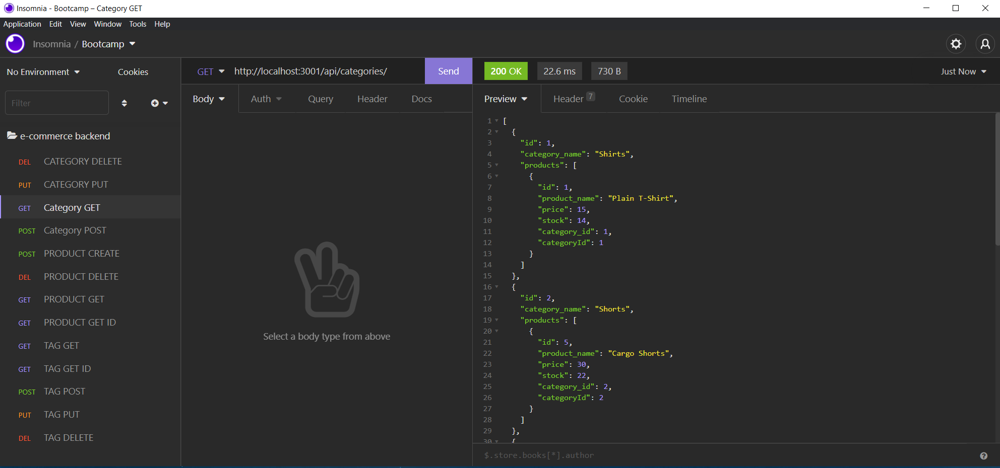

# E-commerce-Back-End #

 ## Table of Contents
* [Description](#description)
* [Installation](#installation)
* [Usage](#usage)
* [License](#license)
* [Contributors](#contributors)
* [Questions](#questions)

## Description
This E-Commerce backend application is to test the different types of METHODS such as POST, GET , DELETE, AND PUT in an ecommerce setting.  
## Install
Make sure to clone the repo, then in the root directory run npm install (sql2, express, env, and sequelize).
## Usage
This can be used to demonstrate the different types of methods and how to change or delete the informaiton in a database.
## License

## Contributors
Christopher Tangarife
## Questions
If you have any questions about the application contact me directly at Christangarife95@gmailcom 
# Contact
Christangarife95@gmail.com 
# Username
Check out my other work on [Github](https://github.com/ChrisCodes54)
# Screenshots and Video Link to walkthrough
Watch the walkthrough video by clicking [here](SHARE THE VIDEO LINK HERE)

